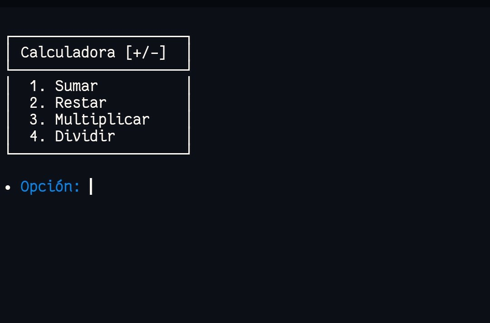
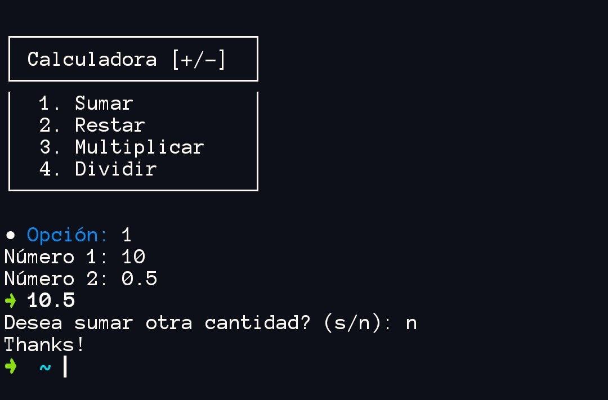
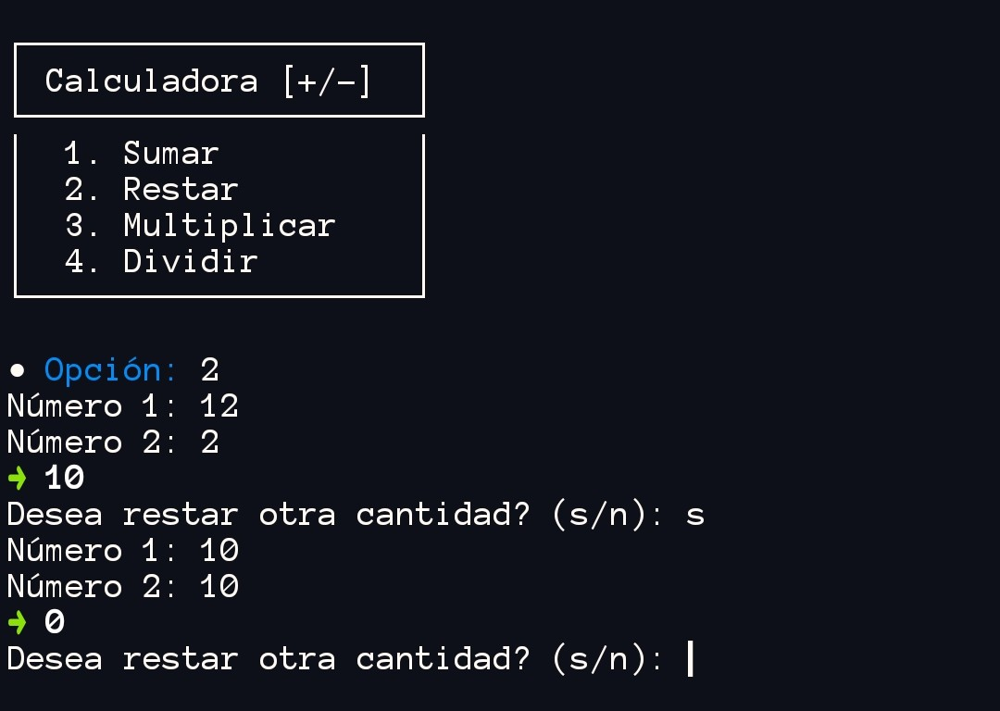

# Calc
Una calculadora básica e interactiva! 🤓
Ofrece funciones como suma, resta, multiplicación y división.



algunos ejemplos:





## Instalar
1. Clone el repositorio:
```bash 
git clone https://github.com/Choscarzz/Calc.git
```
2. Mueva el archivo `calc.sh` a su carpeta de ejecutables
```bash 
mv calc.sh /bin/calc
```
> [!NOTE]
> Asegúrese de que la ruta sea correcta. 

3. Inicie el script
```bash
calc
```

## Sobre Calc
¡Hola! Este es un pequeño proyecto desarrollado en Bash con la intención de aprender un poco más sobre la sintaxis de este hermoso lenguaje de Shell.
